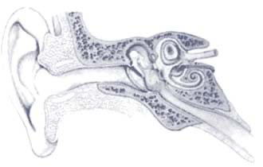

# SEZIONE

"Lorem ipsum dolor sit amet, consectetur adipiscing elit, sed do eiusmod tempor incididunt ut labore et dolore magna aliqua. Ut enim ad minim veniam, quis nostrud exercitation ullamco laboris nisi ut aliquip ex ea commodo consequat. Duis aute irure dolor in reprehenderit in voluptate velit esse cillum dolore eu fugiat nulla pariatur. Excepteur sint occaecat cupidatat non proident, sunt in culpa qui officia deserunt mollit anim id est laborum."

La sintesi digitale nella musica elettronica è stata studiata in modo approfondito [@delduca1987].

Diversi autori hanno affrontato il tema della musica elettronica ([@delduca1987]; [@bianchini2000]; [@dannenberg2003]).

Come sottolinea Del Duca [@delduca1987, p.17]:

> la sintesi digitale...
> blablabla,
> ecco, usando ">" si cita, infatti
> questa è una citazione

\begin{wrapfigure}{r}{0.4\textwidth}
  \centering
  \includegraphics[width=0.38\textwidth]{docs/images/img001.png}
  \caption{Diagramma esplicativo} % <-- qui non mettere #fig:…
  \label{fig:diagramma} 
  \end{wrapfigure}

Questo paragrafo spiega il diagramma. Puoi continuare a scrivere testo qui, ed esso scorrerà automaticamente a sinistra dell’immagine.
"Lorem ipsum dolor sit amet, consectetur adipiscing elit, sed do eiusmod tempor incididunt ut labore et dolore magna aliqua. Ut enim ad minim veniam, quis nostrud exercitation ullamco laboris nisi ut aliquip ex ea commodo consequat. Duis aute irure dolor in reprehenderit in voluptate velit esse cillum dolore eu fugiat nulla pariatur. Excepteur sint occaecat cupidatat non proident, sunt in culpa qui officia deserunt mollit anim id est laborum."

Occhio perché bisogna trovare un modo per andare a capo con l'immagine della wrapfigure... sennò crea problemi... non è automatico. provo se con wrapfig posso comunqneu parlare di @fig:diagramma

Come si vede in @fig:bellissima, il risultato è…

a   b   c
--- --- ---
1   2   3
4   5   6

: Caption {#tbl:label}

Nella Tabella @tbl:label vediamo i dati…

$$
E = mc^2
$$ {#eq:energia}

L’equazione @eq:energia mostra la leggenda…

{#fig:bellissima width=60%}

Per ulteriori approfondimenti sugli strumenti digitali, vedere [@tanzi2005].

L’incisione di *Prometeo* di Luigi Nono è documentata in [@nono1993].

## Sottosezione

"Lorem ipsum dolor sit amet, consectetur adipiscing elit, sed do eiusmod tempor incididunt ut labore et dolore magna aliqua. Ut enim ad minim veniam, quis nostrud exercitation ullamco laboris nisi ut aliquip ex ea commodo consequat. Duis aute irure dolor in reprehenderit in voluptate velit esse cillum dolore eu fugiat nulla pariatur. Excepteur sint occaecat cupidatat non proident, sunt in culpa qui officia deserunt mollit anim id est laborum."

# CONCLUSIONE

Eppur si muove...

# BIBLIOGRAFIA

::: {#refs-bib}
:::

# DISCOGRAFIA

::: {#refs-dis}
:::

# SITOGRAFIA

::: {#refs-sit}
:::

